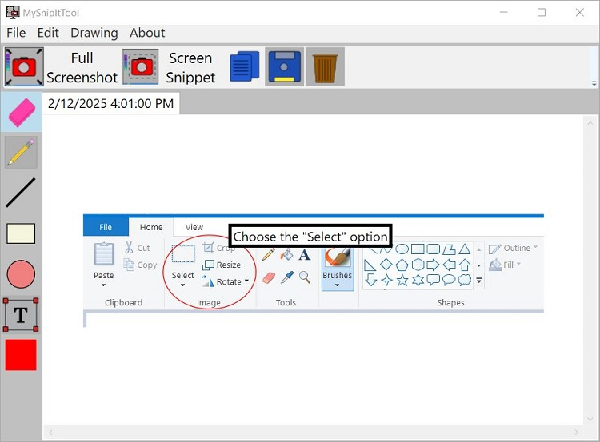

# MySnipItTool
MySnipItTool is a screenshot application for Windows that allows screenshots to be taken and edited in individual tabs via a rich set of annotation tools. This program is designed to make taking multiple screenshots easier for higher productivity and power users.

## Table of Contents

- [Features](#features)
- [Why I Built this Program](#why-i-built-this-program)
- [Contributing](#contributing)
- [History (for Developers)](#history)
- [License](#license)

## Features

- Simple, easy-to-learn user interface
- Full screenshots or screen snippets
- Annotation of screenshots via drawing, shape, and text tools
- Multiple screenshots can be edited simultaneously in separate tabs--no need to save between taking screenshots anymore!

## Why I Built this Program
There has been many times where I needed to take multiple screenshots, and save them to my computer. Many of those times, I wanted to annotate what I had clicked on to produce a particular result when I ran into an error, or I wanted to take multiple screenshots because everything did not fit on the screen. While the built-in Snipping Tool application has enough features for basic screenshot-taking, it doesn't offer many drawing options, and you have to save your screenshot before you take a new one. I sort of wanted features of both Paint and the Snipping Tool in one, while also allowing one screenshot to be taken and be able to take another without needing to save the previous first. I wanted vector-style drawings, with a basic pen tool and basic shape tools to annotate screenshots, with the ability to choose any color to draw with. With all of these ideas and a little spare time on my hands, MySnipItTool was the result.

## Contributing
If you wish to contribute to making MySnipItTool better, you are free to simply clone the project and add the feature you see fit. Then you can submit a pull request. And I'll hopefully learn the rest in time! The code is written in C#, and WPF is the chosen GUI framework, so you just need Visual Studio with the desktop workload features installed. If you don't wish to make a code contribution, but you want to improve this ReadMe or you have any suggestions/comments/feedback, these contributions are also welcome.

## History (for Developers)
Originally, the code was written using the Windows Forms (Winforms) GUI framework. The problem with drawing in Winforms is, well, drawing. You can easily draw on top of a picture, but erasing will actually erase the picture itself, and there is no type of drawing control or control that would allow easy anchored positioning of GUI items. I probably could have built some type of layering system, but, given my fairly beginner experience at the time, especially with graphics, I did not wish to pursue any further. So, after building a working prototype with Windows Forms, and running into these roadblocks, I scratched the idea of using Winforms and looked into using WPF. After building some basic demo programs with WPF, I set off to rebuilt MySnipItTool using WPF (Windows Presentation Foundation). With WPF, I was able to use the magical Canvas control, which allows shapes and other items to be easily added on top whereever you want (kind of useful when you're drawing where the user says to). Additionally, with WPF, there was more flexibility in improving the user interface and compartmentalizing it into separate, reusable pieces. For example, the ScreenshotTab is its own UserControl, a Canvas, wrapped around an Image, with its own drawing logic. Overall, with WPF, the user interface is able to be a lot cleaner, more modern, and flexible for extension.

## License
MySnipItTool operates under the MIT License.

